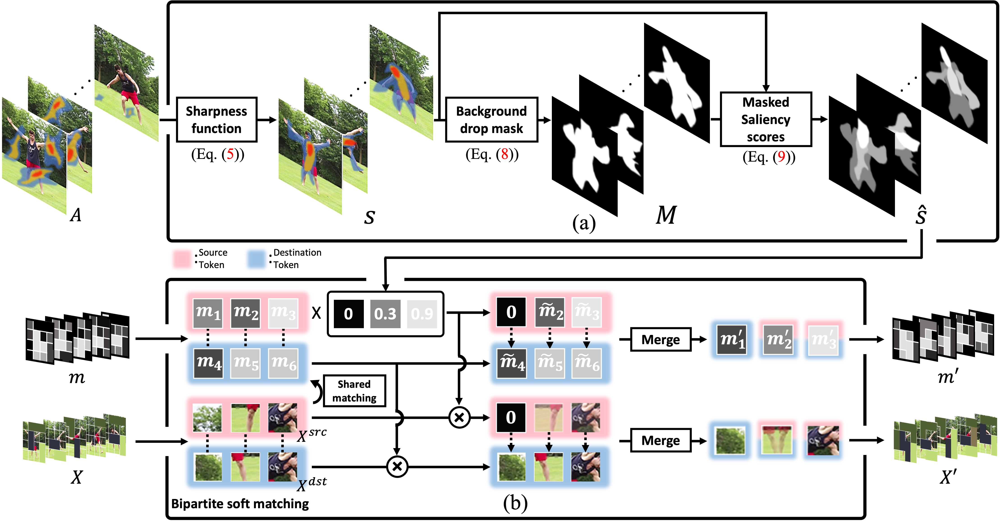

# vid-TLDR


Official implementation of CVPR 2024 paper [vid-TLDR: Training Free Token merging for Light-weight Video Transformer](https://arxiv.org/abs/2403.13347).

[](https://paperswithcode.com/sota/video-retrieval-on-msr-vtt?p=vid-tldr-training-free-token-merging-for)  
[](https://paperswithcode.com/sota/video-retrieval-on-msvd?p=vid-tldr-training-free-token-merging-for)  
[](https://paperswithcode.com/sota/video-retrieval-on-activitynet?p=vid-tldr-training-free-token-merging-for)  
[](https://paperswithcode.com/sota/video-retrieval-on-didemo?p=vid-tldr-training-free-token-merging-for)  
[](https://paperswithcode.com/sota/video-retrieval-on-lsmdc?p=vid-tldr-training-free-token-merging-for)  
[](https://paperswithcode.com/sota/video-retrieval-on-ssv2-label-retrieval?p=vid-tldr-training-free-token-merging-for)  
[](https://paperswithcode.com/sota/video-retrieval-on-ssv2-template-retrieval?p=vid-tldr-training-free-token-merging-for)  

[](https://paperswithcode.com/sota/zero-shot-video-retrieval-on-activitynet?p=vid-tldr-training-free-token-merging-for)  
[](https://paperswithcode.com/sota/zero-shot-video-retrieval-on-didemo?p=vid-tldr-training-free-token-merging-for)  
[](https://paperswithcode.com/sota/zero-shot-video-retrieval-on-msvd?p=vid-tldr-training-free-token-merging-for)  
[](https://paperswithcode.com/sota/zero-shot-video-retrieval-on-msr-vtt?p=vid-tldr-training-free-token-merging-for)  

[](https://paperswithcode.com/sota/visual-question-answering-on-msrvtt-qa-1?p=vid-tldr-training-free-token-merging-for)  
[](https://paperswithcode.com/sota/visual-question-answering-on-msvd-qa-1?p=vid-tldr-training-free-token-merging-for)  

## 1. Setup 
### Requirements
Please refer to [UMT](https://github.com/OpenGVLab/unmasked_teacher) for environments.

### Datasets 
 1. We use seven benchmark datasets (MSRVTT, MSVD, ActivityNet, DiDeMo, LSMDC, SSV2-label, SSV2-Template). 
 2. Follow [DATASET.md](https://github.com/OpenGVLab/unmasked_teacher/blob/main/multi_modality/DATASET.md) to download datasets.

### Pretrained checkpoint.
1. All experiments were evaluated without additional training, utilizing the checkpoint publicly available in UMT. 
2. The model can be obtained from [MODEL_ZOO.md](https://github.com/OpenGVLab/unmasked_teacher/blob/main/multi_modality/MODEL_ZOO.md).

# 2. Evaluation
### Video-Text Retrieval
```
# MSRVTT
CUDA_VISIBLE_DEVICES=5 python tasks/retrieval.py ./exp/finetuning/ret_msrvtt/b16_25m.py      batch_size 1 pretrained_path /path/to/checkpoint/ model.vision_encoder.vidTLDR_use True model.vision_encoder.vidTLDR_r [600,200,100,0,0,0,0,0,0,0,0,0]
CUDA_VISIBLE_DEVICES=1 python tasks/retrieval.py ./exp/finetuning/ret_msrvtt/l16_25m.py      batch_size 1 pretrained_path /path/to/checkpoint/ model.vision_encoder.vidTLDR_use True model.vision_encoder.vidTLDR_r [550,400,0,0,0,0,0,0,0,0,0,0,0,0,0,0,0,0,0,0,0,0,0,0] 

# your_msrvtt_path
# MSVD                      
CUDA_VISIBLE_DEVICES=2 python tasks/retrieval.py ./exp/finetuning/ret_msvd/b16_25m.py        batch_size 1 pretrained_path /path/to/checkpoint/ model.vision_encoder.vidTLDR_use True model.vision_encoder.vidTLDR_r [450,250,200,0,0,0,0,0,0,0,0,0]                     
CUDA_VISIBLE_DEVICES=3 python tasks/retrieval.py ./exp/finetuning/ret_msvd/l16_25m.py        batch_size 1 pretrained_path /path/to/checkpoint/ model.vision_encoder.vidTLDR_use True model.vision_encoder.vidTLDR_r [600,200,100,100,0,0,0,0,0,0,0,0,0,0,0,0,0,0,0,0,0,0,0,0] 

# ActivityNet
CUDA_VISIBLE_DEVICES=4 python tasks/retrieval.py ./exp/finetuning/ret_anet/b16_25m.py        batch_size 1 pretrained_path /path/to/checkpoint/ model.vision_encoder.vidTLDR_use True model.vision_encoder.vidTLDR_r [500,0,0,0,0,0,0,0,0,0,0,0]                           
CUDA_VISIBLE_DEVICES=5 python tasks/retrieval.py ./exp/finetuning/ret_anet/l16_25m.py        batch_size 1 pretrained_path /path/to/checkpoint/ model.vision_encoder.vidTLDR_use True model.vision_encoder.vidTLDR_r [600,300,0,0,0,0,0,0,0,0,0,0,0,0,0,0,0,0,0,0,0,0,0,0] 

# Didemo
CUDA_VISIBLE_DEVICES=6 python tasks/retrieval.py ./exp/finetuning/ret_didemo/b16_25m.py      batch_size 1 pretrained_path /path/to/checkpoint/ model.vision_encoder.vidTLDR_use True model.vision_encoder.vidTLDR_r [250,150,150,150,0,0,0,0,0,0,0,0]                     
CUDA_VISIBLE_DEVICES=7 python tasks/retrieval.py ./exp/finetuning/ret_didemo/l16_25m.py      batch_size 1 pretrained_path /path/to/checkpoint/ model.vision_encoder.vidTLDR_use True model.vision_encoder.vidTLDR_r [800,100,0,0,0,0,0,0,0,0,0,0,0,0,0,0,0,0,0,0,0,0,0,0]   

# LSMDC
CUDA_VISIBLE_DEVICES=0 python tasks/retrieval.py  ./exp/finetuning/ret_lsmdc/b16_25m.py      batch_size 1 pretrained_path /path/to/checkpoint/ model.vision_encoder.vidTLDR_use True model.vision_encoder.vidTLDR_r [400,150,150,0,0,0,0,0,0,0,0,0]                          
CUDA_VISIBLE_DEVICES=0 python tasks/retrieval.py  ./exp/finetuning/ret_lsmdc/l16_25m.py      batch_size 1 pretrained_path /path/to/checkpoint/ model.vision_encoder.vidTLDR_use True model.vision_encoder.vidTLDR_r [250,250,200,200,0,0,0,0,0,0,0,0,0,0,0,0,0,0,0,0,0,0,0,0]

# SSV2-Lable
CUDA_VISIBLE_DEVICES=0 python tasks/retrieval.py  ./exp/finetuning/ret_ssv2_label/b16_25m.py batch_size 1 pretrained_path /path/to/checkpoint/ model.vision_encoder.vidTLDR_use True model.vision_encoder.vidTLDR_r [200,200,200,100,0,0,0,0,0,0,0,0]                          
CUDA_VISIBLE_DEVICES=0 python tasks/retrieval.py  ./exp/finetuning/ret_ssv2_label/l16_25m.py batch_size 1 pretrained_path /path/to/checkpoint/ model.vision_encoder.vidTLDR_use True model.vision_encoder.vidTLDR_r [450,250,100,0,0,0,0,0,0,0,0,0,0,0,0,0,0,0,0,0,0,0,0,0]

# SSV2-Template
CUDA_VISIBLE_DEVICES=0 python tasks/retrieval.py  ./exp/finetuning/ret_ssv2_tpl/b16_25m.py   batch_size 1 pretrained_path /path/to/checkpoint/ model.vision_encoder.vidTLDR_use True model.vision_encoder.vidTLDR_r [400,300,0,0,0,0,0,0,0,0,0,0]                          
CUDA_VISIBLE_DEVICES=0 python tasks/retrieval.py  ./exp/finetuning/ret_ssv2_tpl/l16_25m.py   batch_size 1 pretrained_path /path/to/checkpoint/ model.vision_encoder.vidTLDR_use True model.vision_encoder.vidTLDR_r [350,300,100,50,0,0,0,0,0,0,0,0,0,0,0,0,0,0,0,0,0,0,0,0]  
```

### Video Question Answering
```
# MSRVTT
python tasks/vqa.py ./exp/finetuning/qa_msrvtt/b16_25m.py model.vision_encoder.vidTLDR_use True model.vision_encoder.vidTLDR_r [600,200,0,0,0,0,0,0,0,0,0,0]                          
python tasks/vqa.py ./exp/finetuning/qa_msrvtt/l16_25m.py model.vision_encoder.vidTLDR_use True model.vision_encoder.vidTLDR_r [400,400,100,0,0,0,0,0,0,0,0,0,0,0,0,0,0,0,0,0,0,0,0,0]

# MSVD
python tasks/vqa.py ./exp/finetuning/qa_msvd/b16_25m.py   model.vision_encoder.vidTLDR_use True model.vision_encoder.vidTLDR_r [600,200,0,0,0,0,0,0,0,0,0,0]                          
python tasks/vqa.py ./exp/finetuning/qa_msvd/l16_25m.py   model.vision_encoder.vidTLDR_use True model.vision_encoder.vidTLDR_r [400,400,100,0,0,0,0,0,0,0,0,0,0,0,0,0,0,0,0,0,0,0,0,0]
```

## Citation
```
@inproceedings{choi2024vid,
  title={vid-TLDR: Training Free Token merging for Light-weight Video Transformer},
  author={Choi, Joonmyung and Lee, Sanghyeok and Chu, Jaewon and Choi, Minhyuk and Kim, Hyunwoo J.},
  booktitle={Conference on Computer Vision and Pattern Recognition},
  year={2024}
}
```

